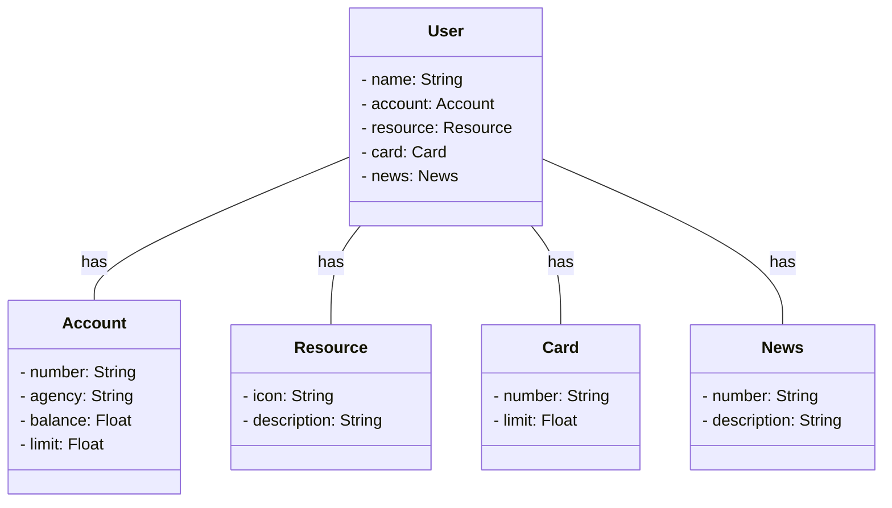

Desafio DIO java com springboot e railway

Diagrama de Classes:

```mermaid

classDiagram
  class User {
    - name: String
    - account: Account
    - resource: Resource
    - card: Card
    - news: News
  }
  
  class Account {
    - number: String
    - agency: String
    - balance: Float
    - limit: Float
  }

  class Resource {
    - icon: String
    - description: String
  }

  class Card {
    - number: String
    - limit: Float
  }

  class News {
    - number: String
    - description: String
  }
  
  User -- Account: has
  User -- Resource: has
  User -- Card: has
  User -- News: has
```